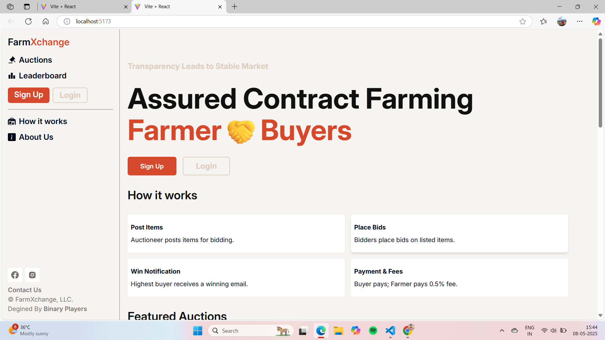

# Auction Platform for Farmers 🧑‍🌾📈

This MERN stack-based platform empowers farmers by providing a stable market access through real-time auction listings, transparent bidding, and secure transactions.

## 🔥 Features
- Farmer and Buyer Authentication
- Real-Time Auction Listings
- Secure Bidding System
- Dashboard for Auction Management

## 📸 Screenshots

### 1. Home Page

> A user-friendly homepage where users can view ongoing auctions.

### 2. Farmer Dashboard

> Farmers can manage their listings, monitor bids, and track auction status.

## 🚀 Tech Stack
- **Frontend:** React.js, TailwindCSS
- **Backend:** Node.js, Express.js
- **Database:** MongoDB
